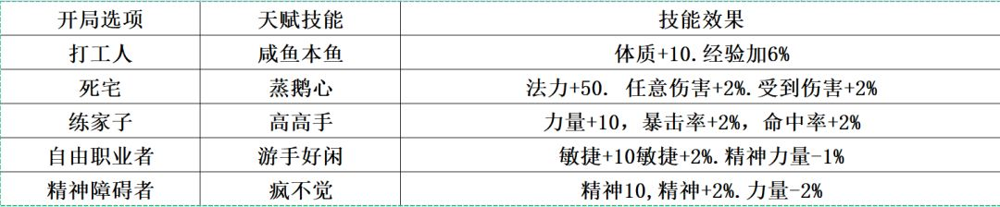

# 基础系统

> 返回[总览](./README.md) · 整合 A、B 两版基础设定。

---

## 装备品质

> A 版：蓝色 ＜ 绿色 ＜ 银色 = 暗金 ＜ 金色剧情 ＜ 血腥 ＜ 橙色传说 ＜ 紫色

- **蓝色、绿色、暗金、血腥**的装备或技能分解 = 蓝色、绿色、金色、红色的萃取精华 ×1。
- **银色剧情** = 金色 ×1 或 2。
- **金色剧情** = 金色 ×5。

## 称号品质

> A 版：蓝色 ＜ 绿色 ＜ 暗金 ＜ 紫色

- 蓝色、绿色、红色、紫色称号碎片 ×2（用于合成称号）。

## 开局职业选择

| 选项 | A 版效果 |
|------|---------|
| ① 打工人 | +体质，+经验（**推荐**） |
| ② 死宅 | +法力，+伤害，+受到伤害 |
| ③ 练家子 | +力量，+暴击，+命中 |
| ④ 自由职业者 | +敏捷，-精神 |
| ⑤ 精神障碍者 | +精神，-力量 |

> B 版补充：**1-3 周目建议打工人，4、5 周目及无限周目建议练家子**。

## 特长选择（法老真陵墓）

特长决定人物主被动技能：

| 特长 | 提问答案 |
|------|---------|
| 力量 | 人（慎选） |
| 体力 | 鳞 |
| 精神 | 羽 |
| 敏捷 | 毛 |

- 按取消，获得隐藏特长——**全能**。
- **隐藏特长全能**：积分掉落翻倍，经验获取 +50%，行动后体力、法力、怒气回复 5%（一周目玩家强烈推荐）。

> B 版周目建议：1 周目**全能**（双倍积分+50% 经验，适合积累资源）、2 周目**体主**（无人屠前抗压）、3-5 周目随意。本攻略采用 **1-5 周目依次为：全、体、力、精、敏** 的打法。

## 加点原则

> B 版：梦魇难度随机应变，可随时自由洗点。小兵战可点满敏捷，BOSS 战根据 boss 属性值、技能性质和己方配置加点。一周目常用**加体质**，少量 boss 加**感知**。

## 梦魇空间（每幕通关后的中转站）

### 休闲区
- **锦鲤抽奖**：每通关一幕可抽一次，随机奖励 6~666666 积分，存读档刷最高收益（66W）。
- **章鱼保罗**：回收高级钓点道具（飞翔荷兰人号×4／安妮女王复仇号×4），随机获得红/绿精粹、功勋道具（艾克斯进化剂、赌斗之券、10w 积分…）、传说灵魂结晶、外观糖豆人/蓝色忧郁。
- **道具商人**：毒烟筒×50、旋转飞盘×50、神仙笔×20、七星灯×20、太平文疏-雨×30、神袛之符×1、野营帐×10（钱够时）。无法使用技能时可普攻或道具打伤害。
- **功勋商人**：出售徽章、结晶体…，购买真魔剑配方、赌斗之券、异常生命见闻录。
- **训练场**：开启训练人偶，主角和樱等级 +1。
- **赌斗**：黑荆（18000 积分+十八相送）、烈山（银色钥匙/圆润珠子，赢 9000 积分）、克尔娜（输全属性-10，赢奇异结晶体×9）。
- **神秘商人**：每通关一幕更新一次。2w 积分换宝石袋、火腿肉换火之刻印、圆润的珠子换光明庇护。
- **钓鱼点 / 等级考核 / 声望商店**：无名智者三件套（经验+10%）、若水六件套（上善若水全队复活）、紫色称号-海王（全属性+50、免疫基础异常）。
- **空间制式装备兑换**：成就积分换血誓套装（前期超前武装，后期红粹材料）。

### 大厅区域
- **空间合成处（右）**：领取精粹、锻造、返回以往世界、多周目招揽队友。
- **空间传送处（上）**：前往下一世界和净白塔（后期挑战四神兽、死亡塔）。
- **空间交易广场（左）**：执法者（仅一次、需执法者外观，购物打八折）。
- **季风**：买人参×300、绷带×300（下世界价格翻倍，需多囤）。
- **功勋**：换梦魇之核（200 功勋）、全面进化针剂等。

### 随身商店 / 锻造台
- 道具-特殊-随身商店：随身买卖、购买精粹。
- 随身锻造台：合成装备（如真·魔剑阿波菲斯）。

### 传送
- 大厅（上）为下一个世界传送处；上方可返回通关过的第 1、4、7、10 世界（多周目可返回每一世界）。

## 常用战斗节奏（B 版 · 老规矩）

> 打 BOSS 前通用套路：

1. **双酒双绷带**：白兰地、龙舌兰（三回合 +20% 体质、力量）+ 医用、军用绷带（3-5 回合恢复体力）。
2. **控制**：缄默（吸蓝、50% 沉默）、精神控制、桃花裁、水月刀（100% 沉默）。
3. **削弱**：诅咒、折戟沉沙、捕蛇者说。
4. **减速**：冰轮、猫袭狂潮、擎天一击。
5. **压制回血**：嗜血、巫蛊术、荒芜、烈炎手套。
6. **道具伤害**：太平文疏-雨（秒精灵）、毒烟筒/毒牙/毒液、旋转飞盘/镔铁回旋镖。
7. **复活**：老山参（群体 40%）、医疗包/灵芝（单体 70%）、上善若水（全员复活+等级+1）、仙豆、光芒之庇护、返魂丹、复活币。

## 强化系统

- 强化道具分**强化石、刻印、宝石**三类。
- 强化石有单属性 +1/+2/+3、全属性 +3/+6/+18/+21 共七种。
- 宝石碎片用于合成三势、五蕴等。

## 关键道具可继承性（B 版）

- **可继承**：仙桃、魔丸、灵珠、魔晶、芬芳浆、达菲尔终极进化针剂、全面进化针剂、龙珠、黑珍珠号等。
- **不可继承（需时先用）**：混沌之杖、光芒之庇护、仙豆、梦幻空花、修普诺斯的祝福、雨书等。

---

**下一章** → [第 0 幕 · 光明丘之谜](./01-第0幕-光明丘之谜.md)