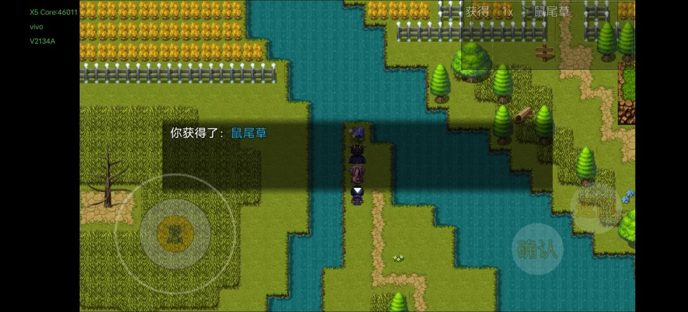

# 第 4 幕 · 英雄传说Ⅱ

> 返回[总览](./README.md) · 上一章：[第 3 幕](./04-第3幕-三国乱斗.md)

**5 个称号**，其中除了圣骑士中心门口的小女孩，所有人都杀光得到绿色称号【以暴制暴】，不太建议获取，太残暴了。

## 平定叛乱（四个村落）

- 出豪森堡向下直走，出示通行证，来到东南村落，开始清理僵尸和起义军。
- **1、东南村落**：3 个僵尸，1 个起义军，1 个村民，房间木桶有小麦点心（村民可选择不杀）。
  - 东南村落向左到小径，再向上拿**鼠尾草**，旁边原野的枯树拿**雷枯木**（从西南村落过去）。小径有临河垂钓点，晚点来。

- **2、西南村落**：3 个僵尸，1 个起义军，黑商杀了获得鱼竿×1、鱼饵×20（黑商可选择不杀）。僵尸掉落的《嗜血》留两本，用于上 debuff。
- **3、正北村落**：3 个带头骑士，旅馆罐子 2000 积分。小女孩、屋内老人家对话后，开启后山铁匠任务前置条件（要杀也先都对话完再杀，不然无法开启支线）。
- **4、西北村落**：3 个带头骑士，2 个村民、房间罐子 2000 积分，有旅店能恢复状态。
- 主线任务-平定叛乱完成，**不急着回豪森堡**。

## 妖精之森 & 复活卢西恩

- 西北村落左边是妖精之森。
- 向左走，梅林法师家接隐藏任务：**迷失的王者**。
- 向上走，击败火之晨曦-琼恩，掉落《技能--聚能火球》、魂力长袍☆、血纹卷轴★。
- 酒吧可补充白兰地和龙舌兰，击杀道具店老板可获得鱼竿×1、鱼饵×99（若把四个村落村民都杀了，这里把店铺老板、酒吧的人和两个见习圣骑士都击杀就能获得以暴制暴称号）。
- 圣骑士中心的左下角漩涡进去，开宝箱（宝石袋、奇异结晶体），**神袛之符复活卢西恩**。
  - 如果第一世界没杀瑟琳娜，世界线会变化，无法在此用血纹卷轴进入琼恩炼金室，他们夫妻俩在后山，二周目再过这条线。
- 向上到小径北，右上蝙蝠洞口击杀暗精灵获得 20w 积分。
- 再向西北到教堂，门口可摘白莲花，奖励**仙豆**（群体满状态恢复，多周目不继承，需时先用）。

## 复活瑟琳娜（夫妻双打）

- 血腥重骑士卢西恩加入队伍，清空他的装备。
- 用法阵复活瑟琳娜，选是，赋予记忆。
- 开始面对夫妻混合双打。
- 杀死两人，获得**第四个邪恶之魂章**。
- 教堂木桶的暗之精灵石拿了，去蝙蝠洞门口打精灵，用道具太平文疏-雨。

## 喵喵入队 & 转职

- 往下走，迷雾森林图中位置去找喵喵。
- 打完老鼠回西南村落，临河垂钓点，喂猫之前老规矩白兰地、龙舌兰、双绷带先用上。
- 击败老巫婆，**喵喵入队**，并获得技能"我很好养的"。
- 东南村落临河垂钓点，钓 200 次，换红色称号【沧海明月】和声望令牌。
- 鲨齿刻印挺不错的，主角和樱都能用。
- 回豪森堡复命，接取任务。
- 去西南村落的大屋二楼，死灵术……（用道具太平文疏-雨）。
- 打完逃出豪森堡，道具-任务-将军密令使用。

## 烈阳要塞 & 后山

- 往右走，**烈阳要塞**，白色的是城门。
- 搜刮木桶，右边帐篷能休息。
- 要塞内部开箱子，击败石骑士。
- 要塞下来，右边山路，走上面的岔路去后山。
- 爬绳子，开箱有红色精粹，后山小屋与铁匠对话，接隐藏任务：**铁匠的心愿**（前置对话小女孩和老爷爷，以及第一幕蒙戈钥匙开的魂灭之触）。
- 右边的洞绳是密道，进斗兽场后，与契约者**永恒、霜狼、黑塔、魔术**战斗。
- 获得血腥钥匙×4：
  - 【永恒】血腥钥匙【宝石、震爆弹+奇异之物×3☆、积分 50000、守护之戒、传承【地】强良】。
  - 【霜狼】血腥钥匙【不明情报、积分 6324、赭纹枪、传承【倮】朱厌☆】。
  - 【黑塔】血腥钥匙【毒烟筒+飞刀+金珠、积分 1234、防弹背心、传承【天】心月狐】（分解）。
  - 【魔术】血腥钥匙【全属性恢复合剂☆、积分 4396、法师袍、传承【鬼】摊】（拿全属性恢复合剂或分解）。
- 破坏四面水晶，救出公爵。
- 右上房间木桶蜜制烤肉。
- 暗怪-起义者，可多刷一会，掉落道具**不明情报（伪）**1500 声望/个（要刷记得把真魔剑下了）。
- 救公爵后回烈阳要塞城堡触发剧情，对话公爵三下属再对话公爵开启隐藏主线：**食子**。
- 前往豪森堡击杀蒙特（低于 20% 血量放雷电风暴，要么防御，要么缄默秒掉），掉落［灾厄之源］。
- 回烈焰要塞跟公爵及其手下对话。
- 一觉睡醒，去后山找铁匠，铁匠家再睡一觉，获得［苦难铸造者★］（比较适合小樱，附送 aoe 技能）。

## 战争的帷幕

- 返回豪森堡对话公爵触发主线任务：**战争的帷幕**。一楼厨房罐子有秘制烤肉。
- 依次对话三个下属获得任务：
  1. **克莱尔——兄弟的召唤**：一个北方村落旅馆老板，一个在北方教堂忏悔。完成获得技能【星月横扫】。
  2. **兰溪子爵**：声望大于 2w 直接战斗，输出很高，全员速度拉满，剑刃风暴+喵袭狂潮+居合道，清完分身，下一回合天基离子炮补掉真身。胜利获得时装【兰溪子爵】和技能《刃舞术☆》（触发武器特殊效果，适用阴毒戒指、毒龙铁胎弓等）。
  3. **乌沙——乌沙的请求**：需要精神大于 100 才可接任务，完成后获得神级控制技能【精神控制★★】。
- 以上 3 个任务均要在主线任务提交前完成。
- 消灭四个村子的所有圣杯骑士即可完成任务，回去找公爵触发主线任务：**全面进攻**。

## BOSS：亚瑟王 & 群山

- 来到最左边亚瑟的城堡，左右两边杀兰斯和帕希尔获得称号【传奇终结者】。
- 调整装备，带上 4 个盾拒，双酒双绷带，加点全体质，学技能，上宝石，中间上去打亚瑟三人组。
- 起手开盾拒上诅咒，单体集火狂战帕西尔，再杀兰斯，最后干掉亚瑟，战斗难度低于灾厄蒙特。
- 亚瑟大概 30% 血左右会放**樱落**，提前全员开盾拒。
- 掉落［亚瑟王冠★］、技能《樱落★》（上 debuff 神技，普攻 aoe 4 段伤害）、星空之钥。
- 完成梅林的嘱托由樱击杀亚瑟完成任务，学会成长型被动技能【真实幸运】。
- 选"否"先不回空间，之后亚瑟所在位置出现漩涡，存档，进去打愚者的手下**群山**，最好起手 sl 缄默一下再对轰（群山 aoe 伤害高、回血多）。
- 群山掉落神级称号【**不动如山★★★★★**】、血腥钥匙【秘制药水×2、积分 443、烈阳手套（左）★★★★、传承【天】武曲星】。
  - 烈阳手套（左）给敌人上灼魂状态每回合掉 2% 最大血量，后期神级装备。
  - 不动如山免疫混乱、加巨额血量，打任何 boss、二郎神的狗子必备。

## 收尾 & 幕间

- 回豪森堡对话公爵一次，去一楼隐藏宝库开宝箱（对话两次的话，出豪森堡就进不去了，包括烈阳要塞，也就不能再刷声望），拿入口进去第一个宝箱——**圣金连环铠★**。
- 第一排第一个加先手，第二排第二个品质最高，推荐拿品质高的圣金连环铠。
- 声望商人"二段斩""噬血"情报伪都卖掉；买暗黑法师外观和十字金纹勋章；撕裂效果的回旋镖来 50 个。
- 探索度 140，回梦魇空间，获得**缚灵噬血咒符**。
- 锦鲤抽奖 66w，神秘商人换宝石袋。
- 补充太平文疏-雨、神仙笔、七星灯，没有野营帐的买 10 个，训练场等级 +1。
- 到净白塔爬玄武塔，4-6 层加点全敏捷，7-8 层全体质，返回换《冰轮★》。
- 返回第四幕世界，任务：**不受欢迎的人**，加点全体质，双酒双绷带，带好缄默诅咒巫蛊，对战公爵。
- 返回梦魇空间，准备妥当，下个世界 boss 会比较艰难。
- 道具-任务-船，进第五个世界。

---

**下一章** → [第 5 幕 · 救阿斗](./06-第5幕-救阿斗.md)