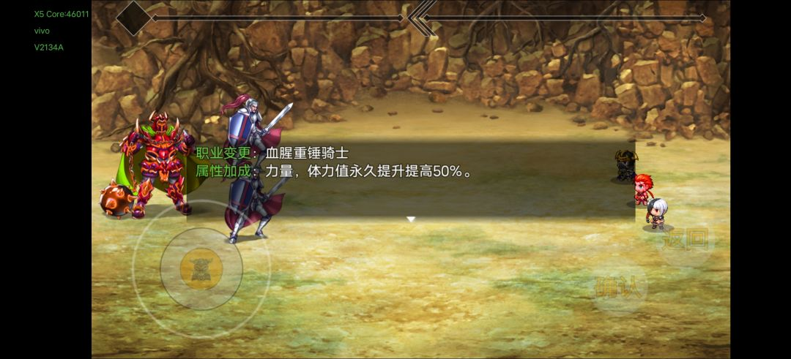

# 第一幕 · 英雄传说Ⅰ

> 返回[总览](./README.md) · 上一幕：[第零幕](./第零幕-光明丘之谜.md)

## 开村

- 桌上获取主线任务，看到木桶都搜刮一下。
- 出门右下角门口光圈的屋子，接受老者委托（**10 个破损古卷**）。
- 左边道具店购买鱼竿×1、鱼饵×200、护身烟×50。
- 正上方酒馆找**卢西恩**，主线开启。买齐另外四种酒，都喝掉，获得称号【品酒高手】。
- **白兰地、龙舌兰各屯 100 瓶**，BOSS 战有用。
- 10 积分一晚的旅馆，良心价！

## 支线 & 奇遇

- 往下直走出村，发光木桶搜刮一下。
- 高地的神秘人，回答问题（正确的是**金色答案**），获得奇遇-**黑暗洞窟**。
- 回村往上直走，高地的神秘人，回答问题，获得奇遇-**地底世界**。
- 左边岔路，波光粼粼的钓鱼点，开始钓鱼。**先存档**，50 次后获得称号【钓鱼大师】。
- 属性点分配：主角加**精神**，卢西恩加**力量**。
- 凑够 10 个古卷拿回去给村长换"传承之戒"。
- 回去继续钓，篝火做**清蒸魔鬼鱼**。
- 金色鳞片×8 换［铁血护额］，换两个。

## 精金洞窟

- 钓鱼点正上方，精金洞窟。
- 左宝箱：主武-长剑，**先存档后分解**，拆分出全部东西为止，主［血之剑］、副［断刃］。
- 右下宝箱：铁锹；中左宝箱：1k 积分；右上宝箱：［骑士靴］。
- 暗怪蝙蝠：几率掉落技能 **"黑暗侵扰"**。
- 消灭 20 只蝙蝠获得称号【黑暗也会怕我】。
- 正上方瀑布的闪光点，奇遇-黑暗洞窟。
- BOSS **幽蓝蝠王**，必掉落技能 **"大黑暗天"**。
- 卢西恩学习技能**"咆哮"**。

## 无人村落 & 前哨营地

- 出洞窟往回走，过桥，走路牌右侧的道路。
- 无人村落：左下角屋子木桶、过桥最右上角屋子木桶；主武［断刃］，进屋接老奶奶委托。
- 村落正下方，前哨营地，栏杆打开。
- 营地敌人别管，先把**胡萝卜地的田鼠**打死，回村落交完线团任务（直接领取是提升先手的金针钗，奖励累积到下一个世界）。
- 出来喂猫，"真·喵之召唤术"，**猫女进队**。
- 去前营哨地，清理敌人。
  - 重剑手掉落 **"盾拒"**，忍者 **"无影利爪"**。
- 猫猫属性点全加敏捷。
- 击败首领得**蓝色钥匙**，使用获得暴击宝石和幽蓝重剑，分解得到［雷霆巨锤］［火刃］。
- 继续往下走，下方营地，高地神秘人，奇遇-**聆听圣言**，清理敌人。
- 帐篷高级忍者，技能 **"隐匿背刺"** 忍者外观。
- 主角学习被动技能 **"才华"**。

## 瑟琳娜的命运

- 回村子酒馆，继续主线，**瑟琳娜的命运**。
- 去卢西恩家拿曾经的装备，给卢西恩穿上。
- 钓鱼点左侧直走，山城左下角高地，奇遇-**古灵精怪**，木桶香肠，中间屋子帮**爱雅**救哥哥。
- 继续左走，帐篷内宝箱拿钥匙和**土之精灵石**。
- 清理完敌人回去开门，香肠救人。
- 见证爱殇爱雅兄妹幸福在一起。
- 山城的右上角小路过去是**北方教堂**。
- 教堂左下角装死的打死，瑟琳娜选择，**"死吧死去更有用"** 战斗三回合内杀死她，获得**第一个邪恶之魂章**。

- 出门编完瞎话，愤怒的卢西恩增强，打 BOSS。
- BOSS 给的绿色钥匙使用，得到**绿荫拳套**（左），**硬木圆盾**可分解得［渡鸦之塔盾］［烈焰盾］。
- 主角学习被动技能 **"卓绝"**。

## 土之精灵 & 隐居小屋

- 回村的路上，蝙蝠洞门口的土之精灵可以打了，**咆哮**控住一次就不会逃跑。
  - 土之精灵石，火刃的灼烧和道具毒牙的毒，道具或持续掉血都能造成伤害，给巨额经验。
- 往下走出村，左边是**隐居小屋**，遇到契约者，卢西恩先咆哮让他混乱很好打，掉落传承〔毛·祸斗〕，进屋与**梅林**谈话，开始收集魔杖。

## 收集三枚魔杖

- 林间小径的右下角的树能挖箱子。
- 左下走，进入妖精之森，左下角紫色植物获得**古灵精怪草**。
- 破坏迷雾之森的魔法阵，清理精英剑盾骑士。
- **大魔导师厄尔尼诺**：会反弹魔法，用**物理攻击**打他。掉落两个群体技能 **"虚幻迷雾" "崩山裂地"** 暗金钥匙，外观-大魔导师。
- 钥匙刷前期神技 **"缄默"**（吸蓝、50% 概率沉默）。
- 法师鞋分解［魔术师之靴］加先手。
- 迪昂蒙戈营地，右边向下走，到达破落的村庄。
- 右下角海边的神秘人，奇遇-**激流勇进**。
- 右上角屋子的老人接女儿的任务，得到信。
- 回蒙戈营地左下角帐篷开始，清理敌人救菲儿，称号【小兵终结者】。
- 回破落村庄，父女重聚，菲儿处可以回复状态。
- 门口的井：**翠绿魔杖**。
- 蒙戈营地，城堡左侧房间：**蔚蓝魔杖**。
- 右走清理敌人，得"跳斩"［秘银甲］暗金钥匙。
- 豪森堡正中央，密室开宝箱战斗：**赤炎魔杖**。

## 秘境 & 地底世界

- 出豪森堡，左边闪光点进入秘境。
- 左上宝箱：恢复技能 **"水润术"** 给猫女。
- 右下宝箱：主武［流水之杖］后面给樱。
- 划船返回原点，结束秘境。
- 道具-任务-奇遇地底世界 使用。
- 宝箱：**灵巧之靴、恶魔篇章、精准指环**，右下角离开秘境。

## 三魔杖 & 八神樱

- 去隐居小屋，将三魔杖交给梅林，战斗完给称号【大收藏家】。
- 进身后密室，使用护身烟。
- 宝箱：**神袛之符、1k 积分、长剑（可分解）、火腿**。
- **八神樱入队**，自带装备，属性点加精神。
- 与梅林告别。
- 称号【幸运之星】掉率翻倍，能用到通关！

## BOSS 蒙戈

- 穿过小径和森林，准备挑战蒙戈。
- 整理属性点、装备、技能、称号。
- 白兰地、龙舌兰提前用（三回合 +20% 体质、力量）。
- 跟 BOSS 对拼输出，或者降他命中。
- 打完获得的银色钥匙先别用。
- 清空卢西恩和猫女装备，点 BOSS 尸体，准备回归。
- **第一幕结束，完成度 123%，获得魔剑阿波菲斯**。

---

## 回梦魇空间（幕间）

- 休闲区各项见[总览](./README.md)。
- 蒙戈银色钥匙使用 →［魂灭之触］［银之重铠］。
- 背包里的主武和装备，蓝色品质的都分解了。
- 魔剑阿波菲斯卸下分解 → 道具-特殊-随身商店 → 随身买卖，购买金色精粹×10 → 随身锻造台，合成**真·魔剑阿波菲斯**。
- 大厅（上）为下一个世界传送处，开始第二幕。

---

**下一幕** → [第二幕 · 黑道争锋](./第二幕-黑道争锋.md)