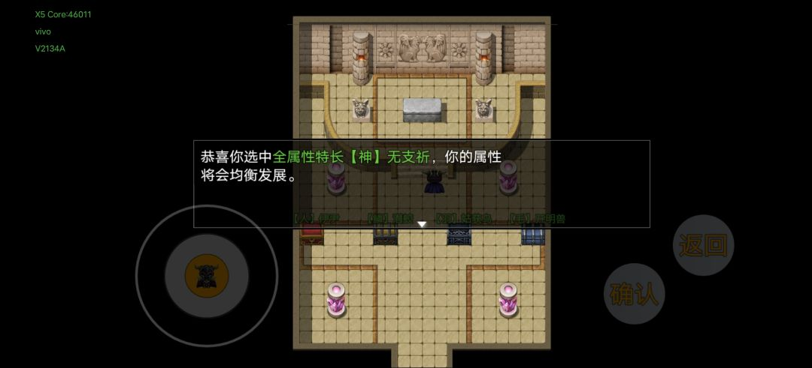

# 第零幕 · 光明丘之谜

> 返回[总览](./README.md)

## 流程

- 金字塔**左右上角**，拿**奇异之物**和**宝石碎片**。
- 金字塔**左右水晶**，礼包领取，特殊-使用。
- 与博士对话，接取任务。
- 装备手枪、手套、防毒面具，称号【我们是冠军】，打怪一直用普攻就行。
- 篝火可恢复满状态一次。
- 道具-特殊-难度调节，开启**梦魇难度**：
  - 双倍积分、经验、掉率，战胜 BOSS 获得额外的挑战点和成就积分。
- 闪光点安装摄像机，转一圈捡牌子。
- 正上方进去调查**石棺**，获得**魔能石**和**样本**。
- 魔能石给石柱充能点亮，**隐藏楼梯**现身。
- **不要踩深色砖块**，红鬼魂打完有两个称号：【智计百出】【勇武过人】。
- 上三楼再返回往左下楼梯走。
- 看到猫就是法老真陵墓。

## 特长选择（决定人物的主被动技能）

| 特长 | 提问答案 |
|------|---------|
| 力量 | 人（慎选） |
| 体力 | 鳞 |
| 精神 | 羽 |
| 敏捷 | 毛 |

- 按取消。

### 隐藏特长：全能
- 积分掉落翻倍，经验获取 +50%，行动后体力、法力、怒气回复 5%。
- **（一周目玩家强烈推荐）**

## 收尾

- 点击发光的石棺获得传承并装备。
- 原路返回，出金字塔找博士提交任务。
- 结算获得**解牛刀**。

---

**下一幕** → [第一幕 · 英雄传说Ⅰ](./第一幕-英雄传说Ⅰ.md)